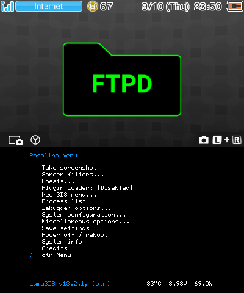
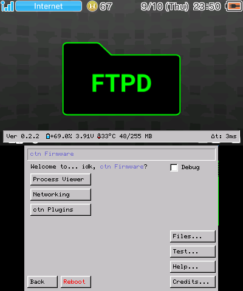
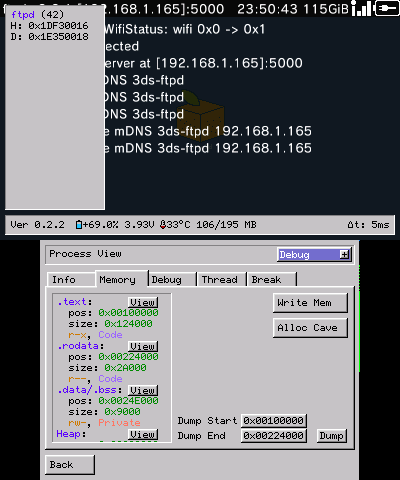

# ctn Firmware
Mod of Luma3DS (v13.2.1) that adds onto the rosalina sysmodule. rosalina stays mostly untouched.

> [!WARNING]
> Might be unstable, many features were simply added, not designed to be user friendly, so good luck figuring stuff out (it might crash if you do something wrong).

# Features
- Compleat Drawing System
  - Top Screen Drawing
  - Custom UI System
  - Draggable Windows
- Process Viewer
  - Debugger (on the 3ds) (debugging some programs may crash/freeze the 3ds)
    - Set breakpoints (no watch points yet)
    - View threads and registers (cant modify registers yet)
  - Memory
    - Read/Write
    - Code Cave Allocator (might be janky)
    - Dumper (with variable size)
    - Searcher
    - Scanner (like cheat engine)
- Custom Plugin Manager
- File System Viewer (cant read files yet, only SD card files)
  - Custom File Transfer System (not ftp) (works whenever, can be used like ftp but in-game)
- Virtual Console Debugger (not on the 3ds)

### Plugins
Plugins allow loading and unloading and running arbitrary code at any point. 
[Read Mode](Plugin.md)
### Virtual Debugger
The virtual debugger allows you to do debug stuff from a pc. ([Needs this](Debug3dsServerConsole/build/Debug3dsServerConsole.dll)) 
[Read Mode](VirtualDebugger.md)
